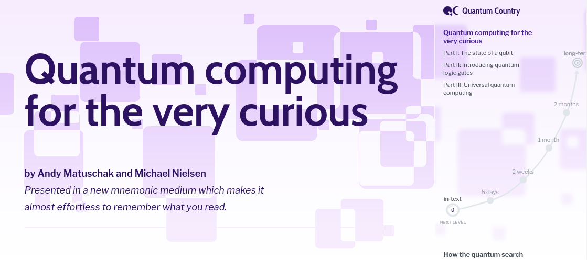
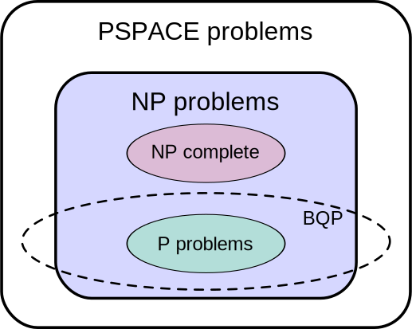

% title: Quantum computing
% author: Miles Gould
% thankyou: Thanks everyone!
% favicon: http://www.stanford.edu/favicon.ico

---

Andy Matuschak and Michael A. Nielsen, “Quantum Computing for the Very Curious”, https://quantum.country/qcvc, San Francisco (2019).
Authors are listed in alphabetical order.

---
title: Questions
build_lists: true

- What are quantum computers?
- Can they do anything that classical computers can't?
- Can they do anything faster than classical computers?
- What is quantum supremacy?
- Will they break all our crypto?
- What *are* they good for?

---
title: Quantum circuits

---
title: Qubits

---
title: Projective geometry

---
title: The Bloch sphere

By <a href="//commons.wikimedia.org/w/index.php?title=User:Smite-Meister&amp;action=edit&amp;redlink=1" class="new" title="User:Smite-Meister (page does not exist)">Smite-Meister</a> - Own work, <a href="https://creativecommons.org/licenses/by-sa/3.0" title="Creative Commons Attribution-Share Alike 3.0">CC BY-SA 3.0</a>, <a href="https://commons.wikimedia.org/w/index.php?curid=5829358">Link</a>

---
title: The quantum search algorithm

---
title: Faster, pussycat! Kill! Kill! Kill!

By <a href="//commons.wikimedia.org/wiki/User:Mike1024" title="User:Mike1024">Mike1024</a> - Own work based on: <a href="//commons.wikimedia.org/wiki/File:Complexity_classes.svg" title="File:Complexity classes.svg">Complexity classes.svg</a>&nbsp;by&nbsp;<a href="//commons.wikimedia.org/wiki/User:Booyabazooka" class="mw-redirect" title="User:Booyabazooka">Booyabazooka</a>., Public Domain, <a href="https://commons.wikimedia.org/w/index.php?curid=1676927">Link</a>

